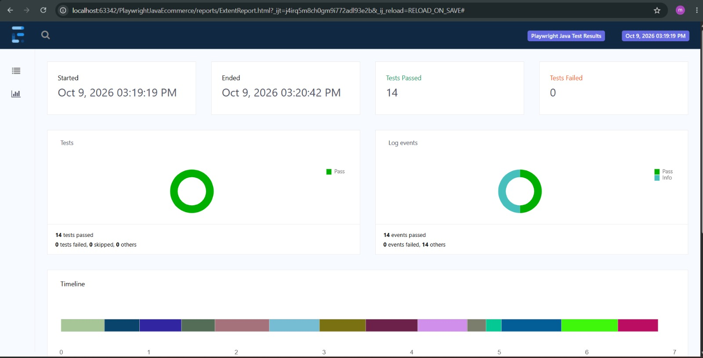

# Playwright Java E-Commerce Automation Framework

## Project Overview

This project is an automation testing framework for an e-commerce website using Playwright with Java. It covers key functionalities such as login, product details, cart operations, checkout, payment, and order confirmation.

The framework uses TestNG for test execution and Extent Reports for test execution reports.

## Technologies Used

* **Programming Language:** Java
* **Automation Tool:** Playwright
* **Test Framework:** TestNG
* **Build Tool:** Maven
* **Reporting:** Extent Reports
* **IDE:** IntelliJ IDEA

## Project Structure

```text
PlaywrightJavaEcommerce/
├── .idea/
├── .mvn/
├── reports/
│   └── ExtentReport.html
├── screenshots/
│   ├── failures/
│   │   └── verifyPaymentAndOrderSummary_20261009_150723.png
│   └── extent-report.png
├── src/
│   ├── main/
│   └── test/
│       └── java/
│           └── ecommerce/
│               ├── base/
│               │   └── BaseTest.java
│               ├── listeners/
│               │   ├── ExtentReportManager.java
│               │   └── TestListener.java
│               ├── pages/
│               │   ├── CartValidationPage.java
│               │   ├── CheckoutPage.java
│               │   ├── CheckoutValidationPage.java
│               │   ├── InventoryPage.java
│               │   ├── LoginPage.java
│               │   ├── OrderConfirmationPage.java
│               │   ├── PaymentPage.java
│               │   └── ProductDetailsPage.java
│               └── tests/
│                   ├── CartTest.java
│                   ├── CartValidationTest.java
│                   ├── CheckoutTest.java
│                   ├── CheckoutValidationTest.java
│                   ├── LoginTest.java
│                   ├── OrderConfirmationTest.java
│                   ├── PaymentTest.java
│                   └── ProductDetailsTest.java
├── target/
├── .gitignore
├── pom.xml
├── README.md
└── testng.xml
```

## Test Scenarios

The framework includes test classes for the following functionalities:

* **Login Test:** Validates user login functionality.
* **Product Details Test:** Verifies product information.
* **Cart Test:** Checks adding products to the shopping cart.
* **Cart Validation Test:** Validates cart product name, price, quantity, product removal, and checkout button.
* **Checkout Test:** Validates checkout functionality.
* **Checkout Validation Test:** Verifies required checkout fields and validation messages.
* **Payment Test:** Tests the payment process.
* **Order Confirmation Test:** Verifies order completion.

## Framework Features

* Page Object Model (POM) structure.
* Reusable base test setup.
* TestNG test execution.
* Extent Reports integration.
* Centralized test listener.
* HTML test execution report.
* Screenshot of the execution report.
* Automatic screenshots for failed tests, when configured.
* Cart product and checkout validation.

## Prerequisites

Install the following before running the project:

* Java JDK 21
* Maven
* IntelliJ IDEA or another Java IDE
* Git (optional, for version control)

## How to Run the Project

**1. Clone the repository**

```bash
git clone https://github.com/kalpeshkm/PlaywrightJavaEcommerce.git
```

**2. Open the project**

Open the project folder in IntelliJ IDEA.

**3. Check Java and Maven**

```bash
java -version
mvn -version
```

**4. Install dependencies**

Open a terminal in the project root and run:

```bash
mvn clean install
```

**5. Execute the test suite**

```bash
mvn test
```

You can also run `testng.xml` directly from IntelliJ IDEA to execute the configured TestNG suite.

## Test Execution Report

The framework generates an HTML report using Extent Reports.

**Report location:**

```text
reports/ExtentReport.html
```

After test execution, open `reports/ExtentReport.html` in a web browser to view the report, provided the report generation is configured to use this path.

### Extent Report Screenshot



## Failure Screenshots

When a test fails, the framework is configured to save a screenshot in the following folder:

```text
screenshots/failures/
```

Example:

```text
screenshots/failures/verifyProductDetailsInCart_<timestamp>.png
```

The screenshot helps identify the page state at the time of failure.

**Note:** Automatic screenshot capture requires the screenshot logic in `BaseTest.java` or `TestListener.java` to run before the browser page is closed. Screenshots must also be explicitly attached to Extent Reports if they need to appear inside the HTML report.

## Configuration Files

* `pom.xml` — Maven dependencies and build configuration.
* `testng.xml` — TestNG suite configuration.
* `.gitignore` — Specifies files and folders excluded from Git version control.
* `BaseTest.java` — Browser setup, page initialization, and teardown.
* `ExtentReportManager.java` — Extent Reports configuration.
* `TestListener.java` — Test result logging and failure screenshot handling.

## Future Enhancements

* Add data-driven testing.
* Add cross-browser testing.
* Integrate the framework with Jenkins.
* Improve automatic screenshots and failure reporting.
* Integrate API testing where required.

## Author

**Kalpesh Mali**

QA Automation Tester
